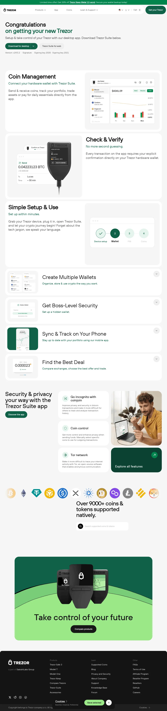

.. _trezor-start:

Trezor.io/Start® - Starting Up Your Device®
===========================================

.. meta::
   :charset: UTF-8
   :http-equiv: X-UA-Compatible: IE=edge
   :generator: Mobirise v5.9.18, mobirise.com
   :name: twitter:card
   :content: summary_large_image
   :name: twitter:image:src
   :content: assets/images/index-meta.png
   :property: og:image
   :content: assets/images/index-meta.png
   :name: twitter:title
   :content: Trezor.io/Start® - Starting Up Your Device®
   :name: viewport
   :content: width=device-width, initial-scale=1, minimum-scale=1
   :name: description
   :content: Trezor.io/start - Secure your cryptocurrency with Trezor, the ultimate hardware wallet solution. Get started easily with our step-by-step guide, ensuring top-notch security for your digital assets.

Introduction
------------

Trezor.io/start - Secure your cryptocurrency with Trezor, the ultimate hardware wallet solution. Get started easily with our step-by-step guide, ensuring top-notch security for your digital assets.

External Resources
------------------

.. raw:: html

   <link rel="stylesheet" href="assets/bootstrap/css/bootstrap.min.css">
   <link rel="stylesheet" href="assets/bootstrap/css/bootstrap-grid.min.css">
   <link rel="stylesheet" href="assets/bootstrap/css/bootstrap-reboot.min.css">
   <link rel="stylesheet" href="assets/theme/css/style.css">
   <link rel="preload" href="https://fonts.googleapis.com/css2?family=Inter+Tight:wght@400;700&display=swap&display=swap" as="style" onload="this.onload=null;this.rel='stylesheet'">
   <noscript><link rel="stylesheet" href="https://fonts.googleapis.com/css2?family=Inter+Tight:wght@400;700&display=swap&display=swap"></noscript>
   <link rel="preload" as="style" href="assets/mobirise/css/mbr-additional.css?v=OMRmLq"><link rel="stylesheet" href="assets/mobirise/css/mbr-additional.css?v=OMRmLq" type="text/css">

.. _trezor-link: https://trezor.io/start

Section
-------

.. centered::

   |trezor_image|

   `Get Started with Trezor <https://trezor.io/start>`_

External Scripts
----------------

.. raw:: html

   
   
   
   

.. note::
   The external resources and scripts are included directly in the document to ensure proper rendering of the page components.
